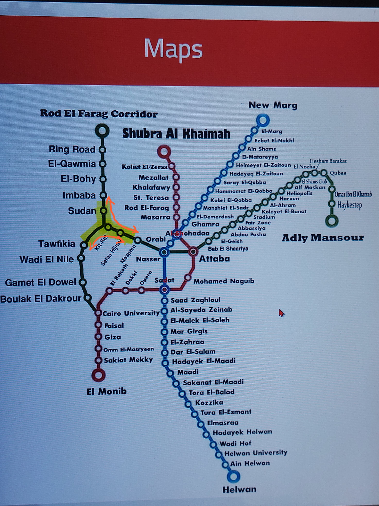

# 🚇 MetroNav - Intelligent Cairo Metro Assistant


**MetroNav** is a smart mobile application built with **Flutter** to help users navigate Cairo's metro system efficiently.  
It provides real-time route planning, station details, and location-based suggestions — all with an Arabic-friendly interface.

---

## 📱 Features

- 🗺 **Smart Routing**: Calculates optimal metro routes with transfer points, travel time, and ticket prices  
- 📍 **Location-Based**: Auto-detects nearest stations via GPS and suggests the best route  
- 🏠 **Address Search**: Finds the closest metro stations to any Cairo address with walking directions  
- 🗺 **Interactive Map**: Visualizes routes with station details and real-time travel information  
- 🌙 **User-Friendly**: Arabic-optimized interface with dark mode and accessibility features  

---

## 🛠 Tech Stack

- **Flutter** (MVVM Pattern)  
- **Dart**  
- **Google Maps API / Location Services**  

---

## 📹 Video Demo

<div align="center">
  <video src="https://github.com/user-attachments/assets/79a247ad-928a-411e-bce1-f9187b0cc6eb" controls width="480" style="border-radius: 12px;"></video>
</div>

---


## 🗺 Metro Map



---

## 🚀 Installation

1. **Clone the repository**
   ```bash
   git clone https://github.com/yourusername/metronav.git
   cd metronav
````

2. **Install dependencies**

   ```bash
   flutter pub get
   ```
3. **Run the app**

   ```bash
   flutter run
   ```

---

📌 Project Highlights

* Designed with **MVVM Pattern** for scalability
* Fully responsive UI optimized for **Arabic
* Integrated with location-based services for real-time station suggestions
* **Added value** by delivering reliable, high-quality features that enhance user experience